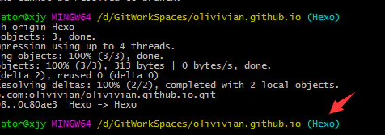
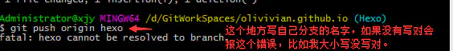

本篇主要是为了本人哪天电脑炸了博客恢复而记录的，如果给您带来了一定指示作用也是令人高兴的一件事，本篇可能部分材料有从他处摘抄，如果侵权(这里不提出从何处引用是因为网上相同内容的太多了，出处不可究)，麻烦联系我删除。谢谢！同时，我尽量写的清楚明白让看到的读者接受。

### 正文

**目的**：针对博客已经搭建并发布过文章的或者是搭建未发布文章的。

1、在你的博客仓库（GitHub）创建一个分支Hexo（这个命名随意）；

2、设置Hexo为默认分支（default）（不知道怎么设的可以百度，建议自己摸索，弄明白GitHub的使用）；**同时底部也给出了创建分支的方法**。

3、将博客仓库clone至本地(`git clone git@github.com:XXXXX/XXXXX.github.io.git `) ，将之前的Hexo文件夹中的
 `_config.yml`，`themes/`，`source`，`scffolds/`，`package.json`，`.gitignore`复制到你克隆下来的仓库文件夹，即Username.github.io；（Username是你自己的用户名）

4、将themes/next/中的`.git/`删除，否则无法将主题文件夹push；

5、在Username.github.io；文件夹执行`npm install`，`npm install hexo-deployer-git`(这里可以看看分支是不是显示为Hexo)

6、执行`git add .`，`git commit -m "提交文件"`，`git push origin Hexo`来提交Hexo网站源文件；

> **注意**：
>
> 

7、执行hexo g -d 生成静态网页部署到github上。
 这样，[Username.github.io](https://links.jianshu.com/go?to=https%3A%2F%2Folivivian.github.io%2F)仓库就有master分支保存静态网页，hexo分支保存源文件。

### 修改

在本地对博客修改（包括修改主题样式、发布新文章等）后

1、执行`git add`，`git commit -m "提交文件"`，`git push origin Hexo`来提交Hexo网站源文件；

2、执行hexo g -d 生成静态网页部署到github上；
 （每次发布重复这两步，它们之间没有严格的顺序）

### 恢复

换电脑想改博客：
 1、安装git；
 2、安装Nodejs和npm；
 3、使用克隆命令将仓库拷贝至本地；
 4、在文件夹内执行命令`npm install hexo-cli -g`、`npm install`、`npm install hexo-deployer-git`；

### 其他

在github上直接创建分支的方法，直接输入新的分支名，回车即可。

### 附录

这里稍作说明：

##### 添加ssh-keys

1. 在终端下运行：`ssh-keygen -t rsa -C "yourname@email.com"`，一路回车；
2. 会在.ssh目录生成`id_rsa`、`id_rsa.pub`两个文件，这就是密钥对，id_rsa是私钥，千万不能泄漏出去；
3. 登录Github，打开「Settings」-->「SSH and GPG keys」，然后点击「new SSH key」，填上任意Title，在Key文本框里粘贴公钥id_rsa.pub文件的内容，注意不要粘贴成`id_rsa`，最后点击「Add SSH Key」。

##### hexo的源文件

这里说一下步骤4为什么只需要拷贝6个，而不需要全部：

1. `_config.yml`站点的配置文件，需要拷贝；
2. `themes/`主题文件夹，需要拷贝；
3. `source`博客文章的.md文件，需要拷贝；
4. `scaffolds/`文章的模板，需要拷贝；
5. `package.json`安装包的名称，需要拷贝；
6. `.gitignore`限定在push时哪些文件可以忽略，需要拷贝；
7. `.git/`主题和站点都有，标志这是一个git项目，不需要拷贝；
8. `node_modules/`是安装包的目录，在执行`npm install`的时候会重新生成，不需要拷贝；
9. `public`是`hexo g`生成的静态网页，不需要拷贝；
10. `.deploy_git`同上，`hexo g`也会生成，不需要拷贝；
11. `db.json`文件，不需要拷贝。

其实不需要拷贝的文件正是`.gitignore`中所忽略的。

